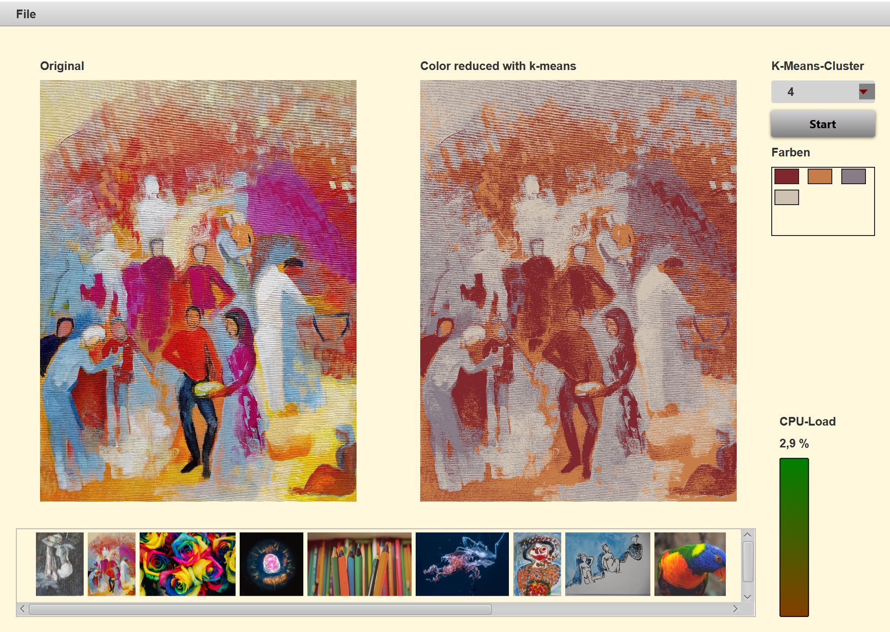

# K-Means Case Study

This project is a starting point for an exercise to speedup an Java application by applying parallel concepts.

Starting from a simple naive implementation it is step by step shown how to apply several patterns to increase reactivity and response time.

This project is part of a lesson hold on the university of applied sciences Kaiserslautern.

Remarks
* The project was build with OpenJDK 11 
* The application uses [oshi](https://github.com/oshi/oshi) (Native Operating System and Hardware Information)
* Dependencies to JavaFX and the oshi libraries are managed by Maven

Main class: `app.SimpleKMeans`

---

### The Show Case Application

The application offers a simple user interface. You can load a directory with jpg- and png-files. The contents of the directory are shown below.

A selected image displayed on the left can be color reduced by using the k-means algorithm. The value for k can be selected. After processing the main colors and the color reduced image are shown. The colored reduced image can be saved as an png-file. 

---

### Exercise

Performance bottlenecks and problems to be solved: 

1. Start of the application (the method `initialize` in the class `app.ui.UIController`)
2. The creation of the color list in `kmeans.imagedata.util.KMeansImage`
3. Loading and creation of the preview images in `util.FileIOHelper`
4. Calculation of the color reduced image in the class `kmeans.KMeans`
5. During the calculation of the color reduced image the application is not responsive 

Refactoring tasks:

1. Decouple the hardware initialization from the start-up (task parallelism)
2. Decouple the k-means calculation from the JavaFX thread (task parallelism)
3. Improve the loading of the pre images (data parallelism)
4. Changing the k-means algorithm so that parallel Java-Streams are used. Introduce appropriate user defined collectors (data parallelism)
5. Build-in timeout constraints for the asynchron tasks

---
